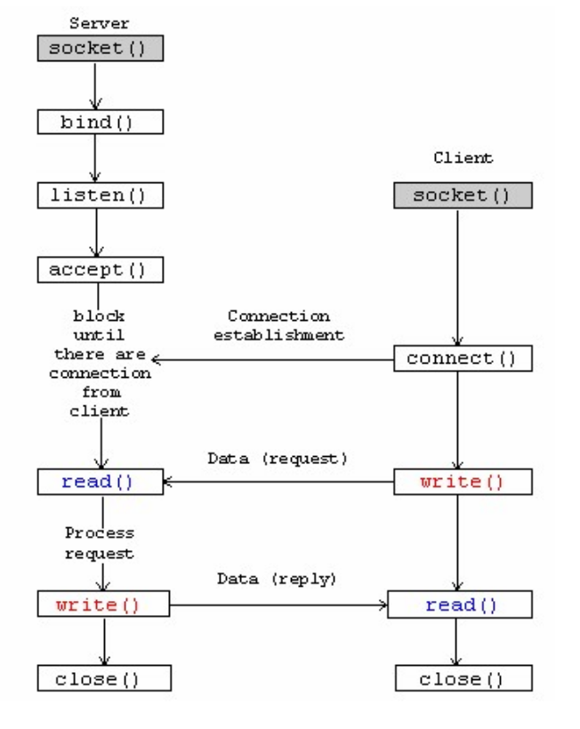
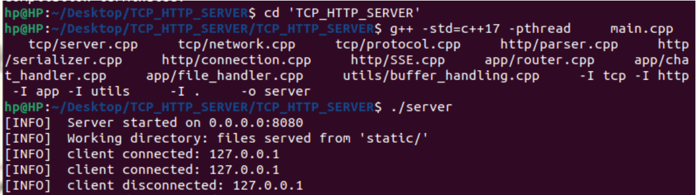
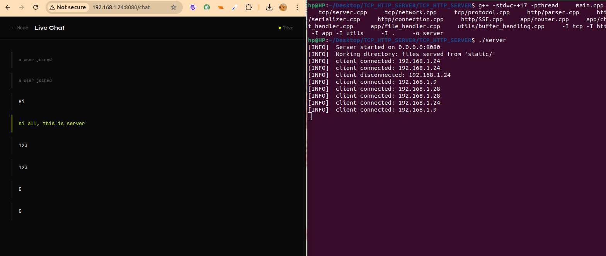
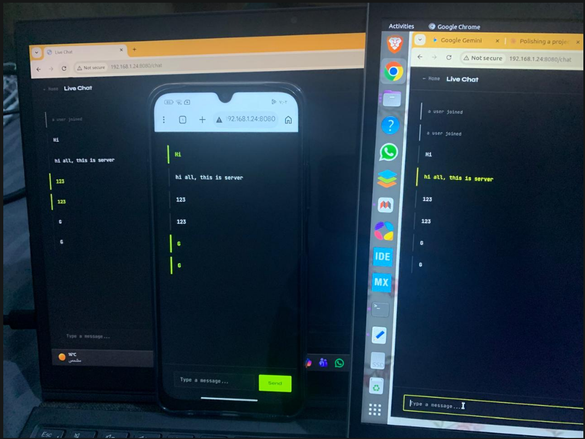
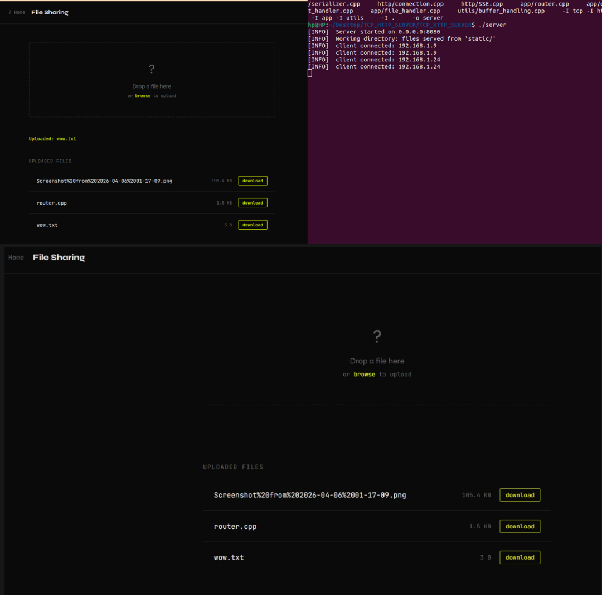

# TCP/HTTP Server

# 🌟 Highlight

A portable, multithreaded HTTP1.1 server build in C++, with no dependencies, manual parsing, real-time chat via SSE, and file sharing.

# ℹ️ Overview

TCP/HTTP1.1 server that acepts browser connections, routes requrests, and serves response all on top of raw sockets. It handles multiple clients simulateounsly using a thread-per-clien model, supports persistent connections, and file upload/download.

### architecture & organization:

```plaintext
tcp:
	server
	client
	network
	protocol
	message

utils:
	error_handling
	buffer_handling
	logging

http:
	parser
	serializer
	connection
	SSE //upgrade
	httpRequest
	httpResonse

app: //application layer
	router
	//mime (content for browser/needed with websockets/upgrade)
	chat_handler
	file_handler

static:
	index.html
	chat.html
	file.html

main
platform
uploads directory
```




### Main Features and Functionalities:

1. Manual HTTP/1.1 parser: splits requests lines, headers, body, and normalize header keys to lowercase.
2. Real-time messaging and broadcast via SSE.
3. File sharing (upload and download) (`GET`/`POST`)
4. Two protocols: raw TCP length-prefixed framing, and HTTP1.1 plaintext (byte stream).
5. Keep-alive connection management, reading connetion header and decides per-request whether to loop or cloose.
6. Thread-safe client list protected using `std::mutex` guards.
7. cross-platform abstraction (winsock / POSIX)

### Run Examples









### Some Design Choices

- Use of `read_until_complete` instead of `recv`: because `send()`/`recv()` don't respect message boundaries, e.g. sending "hello" might arrives as "hel" then "lo", `read_until_complete` reads until `\r\n\r\n` ensuring complete request.

### Limitations

- No `select()`/`epoll()`: `read_until_complete` reads until `\r\n\r\n` then continue reading according to content-length causing partial read of large uploads (large uploads can stall other requests on the same connection)

- Thread-per-client doesn't scale, each connection spawns a detached thread.
- No TLS, all traffic is plain tesxt.
- `uploads/` directory is not created by server, if folder is missing, all uploads fail with `500 Internal Server Error` (user must create it)
- Chunked transfer encoding not supported.

# ⚙️ Requirements, Build & Run

**Requirements**

- C++ 17 or later

- GCC/G\++ (Linux) or MSVC/Clang (windows)
- pthreads (`-pthread` on Linux) (`std::thread` on windows)

1. Run directly from IDE (Visual Stuido)
2. Build and Run on Linux Terminal

   ```plaintext
   g++ -std=c++17 -pthread main.cpp server.cpp network.cpp protocol.cpp parser.cpp \
       serializer.cpp router.cpp connection.cpp buffer_handling.cpp chat_handler.cpp \
       file_handler.cpp SSE.cpp -o server

   //if files are organized as in repo
   g++ -std=c++17 -pthread \
       main.cpp \
       tcp/server.cpp \
       tcp/network.cpp \
       tcp/protocol.cpp \
       http/parser.cpp \
       http/serializer.cpp \
       http/connection.cpp \
       http/SSE.cpp \
       app/router.cpp \
       app/chat_handler.cpp \
       app/file_handler.cpp \
       utils/buffer_handling.cpp \
       -I tcp -I http -I app -I utils \
       -I . \
       -o server

   ./server
   ```

**How to chat from different devices**

0. use only one device as a server (`0.0.0.0`)
1. devcies must be on the same wifi network
2. find local ip

   ```c
   //windows
   ipconfig

   //linux
   ip a
   hostname -I
   ```
3. allow port through your firewall => confirm server is listening

   ```c
   //windows:
   netstat -a | find "8080"

   //linux
   //if no ufw (not installed) -> no blocking/ use iptables -> go to next step (4)
   //if ufw inactive, run the server -> go to step (5)
   //if ufw active, allow 8080 with below code
   sudo ufw allow 8080/tcp

   //to check on ufw status
   sudo ufw status
   //check iptables
   sudo iptables -L
   ```
4. open : windows defender firewall -> advanced settings -> inbound rules -> new rule -> port => tcp -> 8080 -> allow

   or use code

   ```c
   //windows
   New-NetFirewallRule -DisplayName "HTTP Server 8080" -DirectionInbound -Protocol TCP -LocalPort 8080 -Active Allow

   //linux
   sudo iptables -A INPUT -p tcp --dport 8080 -j ACCEPT
   ```

5. connect from other devices on `ip from step2:8080/chat` on browser, and open same url on server machine browser

---

After running open via `http://localhost:8080` in your browser and test chatting & file sharing.
**Tested on:**  Linux (Ubuntu 22.04)  Windows 11  *— GCC/Clang/CMake, Visual Studio.*
